本篇文章描述使 [DartPad](https://dartpad.dev/) 可以在本地运行。

TLDR：如果想运行 [dartpad-local](https://github.com/frankfancode/dartpad-local) 可以直接跳到 [使用dartpad-local](#使用dartpad-local) 小节 


```

官方现有 [DartPad源码](https://github.com/dart-lang/dart-pad)不支持完全的离线使用，所以我们需要修改一些源码，主要是改 host 地址，把外部资源放到本地。
下面开始。
## 准备代码
首先把 dartpad 的代码克隆下来

```bash
git clone https://github.com/dart-lang/dart-pad.git
```


查看下目录结构

```bash
tree -L 2
.
├── AUTHORS
├── CONTRIBUTING.md
├── LICENSE
├── README.md
├── doc
│   └── Sunflower.png
└── pkgs
    ├── dart_pad
    ├── dart_services
    ├── samples
    └── sketch_pad

```

本地化 DartPad 主要是修改 `dart-pad/pkgs/dart_pad` 和 `dart-pad/pkgs/dart_service`。
`dart_pad` 是 前端页面，用于展示代码和预览代码的运行效果。
`dart_service` 是服务器用于接收、运行前端上传的代码，以及返回运行结果。
可以参考官方的开发文档 [CONTRIBUTING.md](https://github.com/dart-lang/dart-pad/blob/main/CONTRIBUTING.md) 看下如何运行。

进入 `dart_pad`  目录启动尚未修改的 dartpad 页面

```
$ dart pub get
$ dart ./tool/grind.dart serve
```
> 
> **重点提醒：每次执行 `dart ./tool/grind.dart serve` 都会触发内部的构建命令，会重新下载代码并重新构建，这不是必须的**
> 可以通过在 `grind.dart` 另外添加一个方法 `run`，之后只执行 `dart ./tool/grind.dart run`


```dart
/// dart-pad/pkgs/dart_services/tool/grind.dart
@Task()
Future<void> run() async {
  await _run(Platform.executable, arguments: [
    path.join('bin', 'server.dart'),
    '--channel',
    _channel,
    '--port',
    '8082',
  ]);
}
```


经过数秒后应该会在终端中看到 如下结果，说明 dartpad 的前端部分已经在本地运行起来了

``` 
...
...
  build/scripts/embed_html.dart.js compiled to 540k
  build/scripts/embed_inline.dart.js compiled to 538k
  Removed 0 Dart files

serve

finished in 42.2 seconds
Serving at http://localhost:8000
```

打开 `http://localhost:8000` 界面如下。默认页面是 Dart 的，可以尝试修改 `sample` 切换成 Flutter 页面。Flutter 程序的处理和预览机制 比 Dart 程序的处理预览机器更复杂。


| dart                                |  flutter                             |
| ----------------------------------- | ----------------------------------- |
| 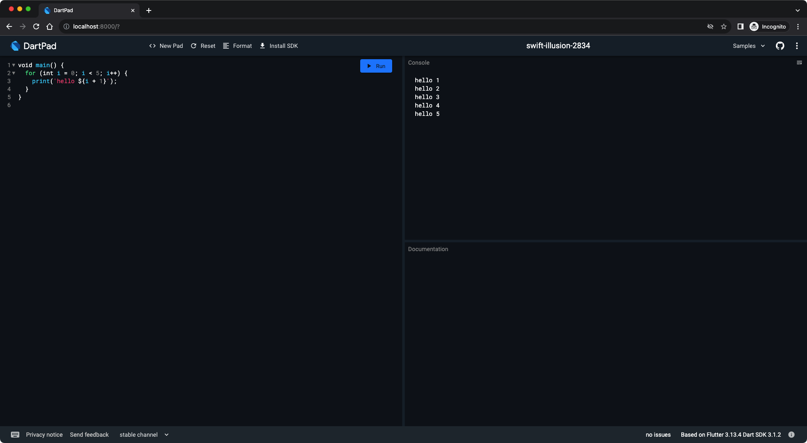 | 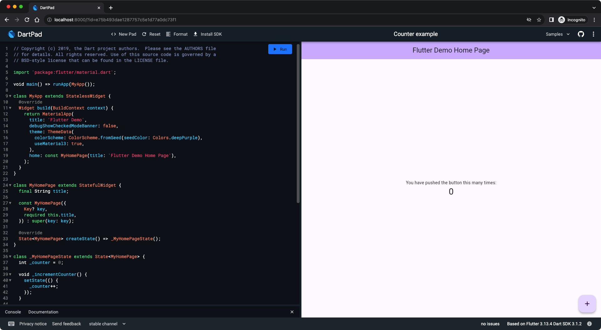 |


 
 虽然通过打开 `http://localhost:8000` 可以看到 DartPad 运行在本地，但是还有很多资源是通过网络获取的。这些可以通过打开调试器看到
 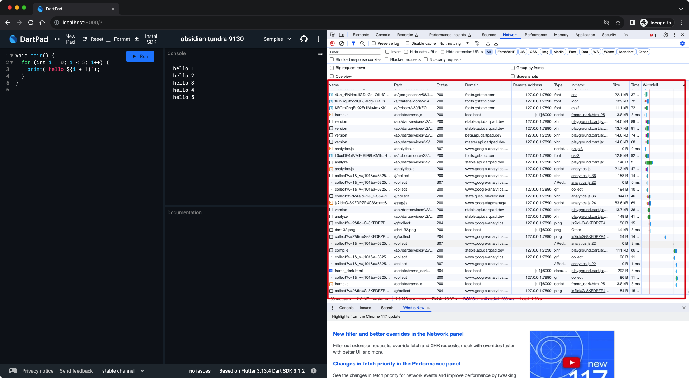

可以看到有很多资源是从互联网获取的，仅使用Dart功能和使用Flutter功能获取的互联网资源是不同的，我们先把 Dart 进行完全离线化

## 本地化 Dart
### 去掉 google analytics
首先统计功能对于本地化版本是无用的，我们可以把统计功能去掉。
搜索以下代码并删掉

```html
<script src="scripts/ga.js" defer></script>
```

我是把以下文件中对 ga 的引用删除了

```
pkgs/dart_pad/test/embed/embed_test.html      |   1 -
pkgs/dart_pad/web/embed-dart.html             |   1 -
pkgs/dart_pad/web/embed-flutter.html          |   1 -
pkgs/dart_pad/web/embed-flutter_showcase.html |   1 -
pkgs/dart_pad/web/embed-html.html             |   1 -
pkgs/dart_pad/web/embed-inline.html           |   1 -
pkgs/dart_pad/web/index.html 
```


重新启动 Darpad 服务再看一下dev console 已经没有对 google analytics 的请求了。
（如果没有效果请 删掉 build 目录并且强制刷新下 浏览器或者换个浏览器。）
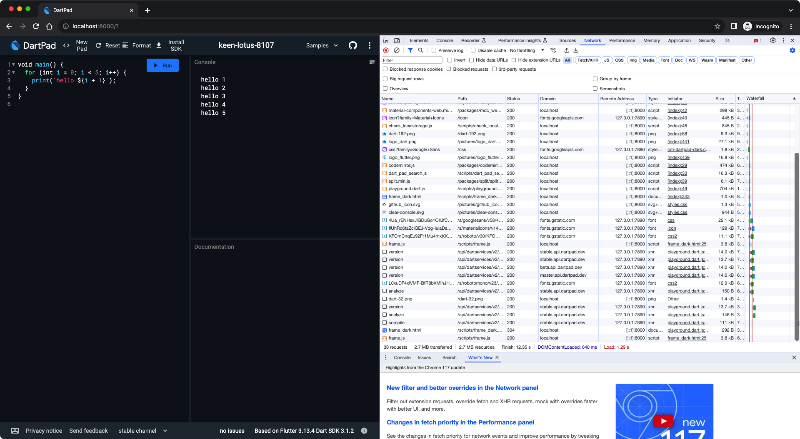

### 使用本地服务器  DartService 
通过 dev console 我们可以看到后台服务器使用是 `api.dartpad.dev`
我们换个命令使得 dartpad 可以指向本地服务器

```
在 dart-pad/pkgs/dart_pad 目录下执行
$ dart ./tool/grind.dart serve-local-backend
```

这个命令可以从 `dart-pad/pkgs/dart_pad/tool/grind.dart` 找到。
在 Dev Console 中可以看到 DartPad 指向的服务器变成了 `127.0.0.1` 和 `localhost`。
并且 `compileDDC` 请求的地址的端口为 `8082`。
所以我们启动的 DartService 也需要在 8082 端口提供服务。
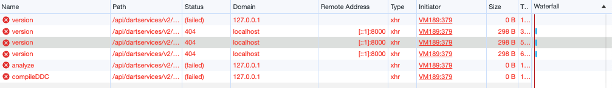
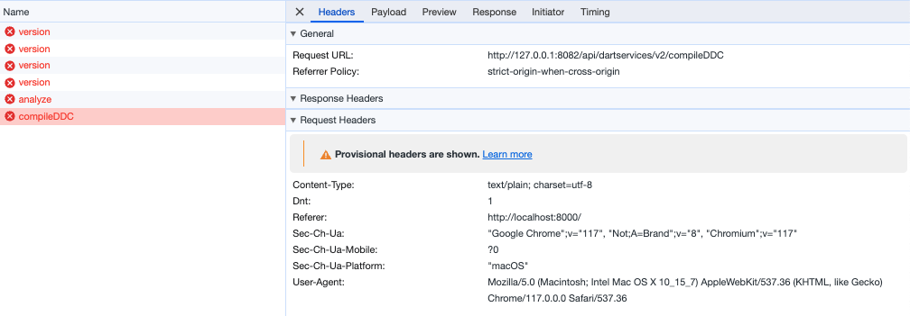
接下来我们来启动 `dart_services`

```bash
cd dart-pad/pkgs/dart_services
dart pub get
# 这一步骤需要有好网络，而且比较耗时
FLUTTER_CHANNEL="stable" dart tool/grind.dart serve
```

经过漫长的等待后可以看到如下输出，说明 dart_service 服务启动了并且监听端口是 `8082`

```
.....
serve
  Running /Users/frank/fvm/versions/stable/bin/cache/dart-sdk/bin/dart bin/server.dart --channel stable --port 8082
  warning: no redis server specified.
  [info] Initializing dart-services:
  port: 8082
  sdkPath: /Users/frank/workspace/opensourcecode/dartpad/newdartpad/dart-pad/pkgs/dart_services/flutter-sdks/stable/bin/cache/dart-sdk
  redisServerUri: null
  Cloud Run Environment variables:
  [severe] PK_GITHUB_OAUTH_CLIENT_ID environmental variable not set! This is REQUIRED.
  [severe] PK_GITHUB_OAUTH_CLIENT_SECRET environmental variable not set! This is REQUIRED.
  [severe] GitHub OAuth Handler DISABLED - Ensure all required environmental variables are set and re-run.
  [info] Starting analysis server (sdk: flutter-sdks/stable/bin/cache/dart-sdk, args: --client-id=DartPad)
  [info] Analysis server initialized.
  [info] Listening on port 8082
```

打开 `http://localhost:8000/` 后看到已经是通过本地的服务器进行处理了
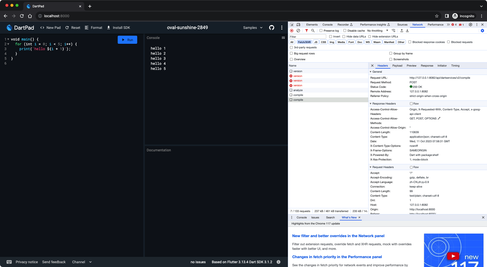

把网络断掉试一下看看是否真离线
虽然功能正常，但页面乱掉了，通过看控制台可以发现应该是字体包没有下载
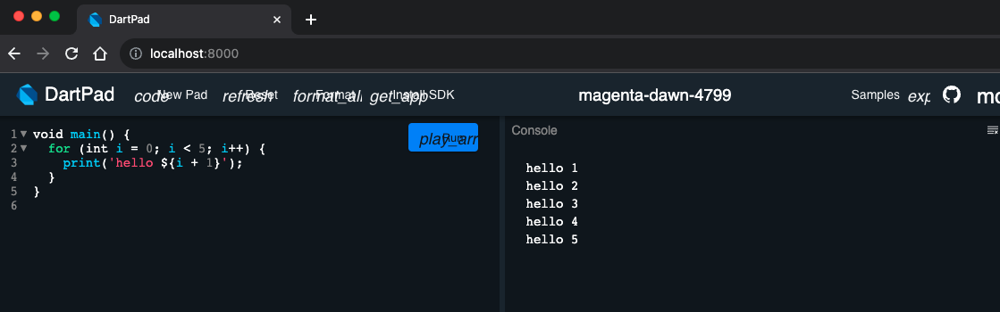
需要把字体改成从本地加载
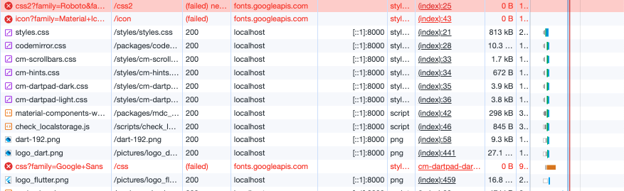

搜索引用远程字体的代码删掉。
`https://fonts.googleapis.com/css2?`  
`https://fonts.googleapis.com/icon`
`https://fonts.googleapis.com/css`

然后把字体放到本地，具体下载哪个文件可以打开引用字体的资源地址，比如打开上图中报红的 url
`https://fonts.googleapis.com/icon?family=Material+Icons`

```
/* fallback */
@font-face {
  font-family: 'Material Icons';
  font-style: normal;
  font-weight: 400;
  src: url(https://fonts.gstatic.com/s/materialicons/v140/flUhRq6tzZclQEJ-Vdg-IuiaDsNcIhQ8tQ.woff2) format('woff2');
}

.material-icons {
  font-family: 'Material Icons';
  font-weight: normal;
  font-style: normal;
  font-size: 24px;
  line-height: 1;
  letter-spacing: normal;
  text-transform: none;
  display: inline-block;
  white-space: nowrap;
  word-wrap: normal;
  direction: ltr;
  -webkit-font-feature-settings: 'liga';
  -webkit-font-smoothing: antialiased;
}
....
....
....
```

把上面的 woff2 下载到本地目录中，我放到了 `dart-pad/pkgs/dart_pad/web/font/`下， 然后把代码放到 `dart-pad/pkgs/dart_pad/web/styles/styles.scss` 中
具体修改如下

```scss
// 以下为 styles.scss 添加的代码
@font-face {
font-family: 'Material Icons';
font-style: normal;
font-weight: 400;
src: url(../font/flUhRq6tzZclQEJ-Vdg-IuiaDsNcIhQ8tQ.woff2) format('woff2');
}

.material-icons {
font-family: 'Material Icons';
font-weight: normal;
font-style: normal;
font-size: 24px; /* Preferred icon size */
display: inline-block;
line-height: 1;
text-transform: none;
letter-spacing: normal;
word-wrap: normal;
white-space: nowrap;
direction: ltr;
/* Support for all WebKit browsers. */
-webkit-font-smoothing: antialiased;
/* Support for Safari and Chrome. */
text-rendering: optimizeLegibility;
/* Support for Firefox. */
-moz-osx-font-smoothing: grayscale;
/* Support for IE. */
font-feature-settings: 'liga';
}
```

重启 dartpad，这时候再打开 `http://localhost:8000/` 即使在离线情况下也能正常使用本地化DartPad 网站了。
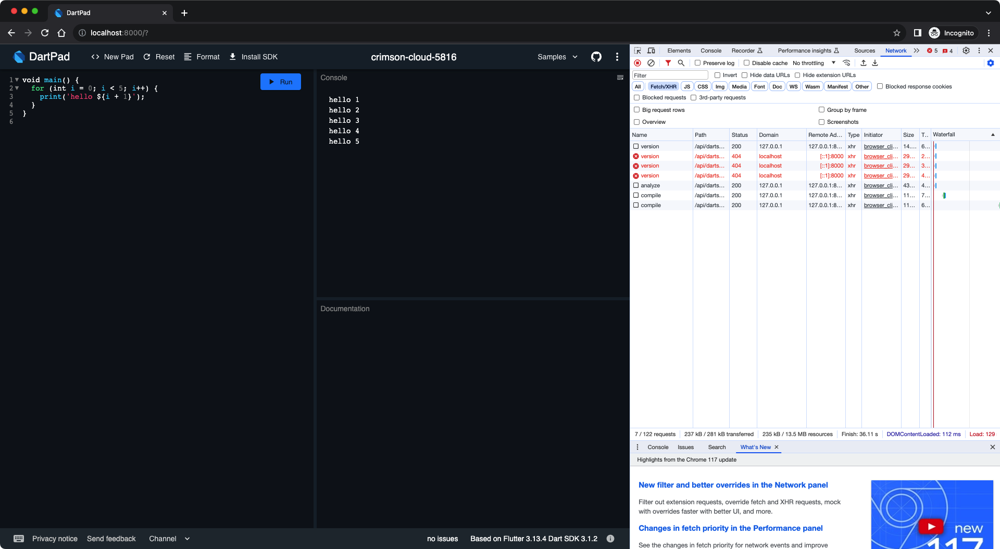

如果你的目标是只让 Dart 完成 本地化，并不需要 Flutter ，那么你的目标达成了。🎉


## 本地化Flutter 
本地化 Flutter 需要的改动更大。因为需要渲染出页面用到的资源更多。从控制台的请求中可以看到还请求了若干资源

```bash
# 注意，你的地址中的版本号可能和这里的不一样
https://storage.googleapis.com/nnbd_artifacts/3.1.2/dart_sdk.js
https://storage.googleapis.com/nnbd_artifacts/3.1.2/flutter_web.js

# 注意，你的地址中的hash值可能这里的不一样
https://www.gstatic.com/flutter-canvaskit/9064459a8b0dcd32877107f6002cc429a71659d1/chromium/canvaskit.js
https://www.gstatic.com/flutter-canvaskit/9064459a8b0dcd32877107f6002cc429a71659d1/chromium/canvaskit.wasm
https://fonts.gstatic.com/s/roboto/v20/KFOmCnqEu92Fr1Me5WZLCzYlKw.ttf

```
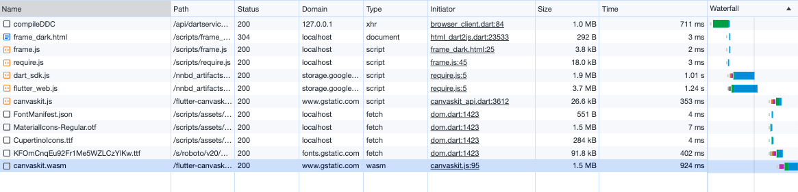
我们要做的就是把请求上面资源的代码处的请求改成从本地请求。
###  flutter_canvaskit 放在本地
先把 `canvas` 相关内容放到 本地
修改 `dartpad/newdartpad/dart-pad/pkgs/dart_pad/lib/sharing/editor_ui.dart` 中

``` dart
static String _createCanvasKitBaseUrl(String engineSha) {
	// const baseUrl = 'https://www.gstatic.com/flutter-canvaskit/';
	const baseUrl = '../flutter-canvaskit/';
	return path.join(baseUrl, '$engineSha/');
}

```

把从控制台中看到的 `canvaskit.js` 和 `canvaskit.wasm` 放到 `dart-pad/pkgs/dart_pad/web/flutter-canvaskit` 中，目录结构如下。其中的哈希值需要根据控制台中返回的地址的变化而变化，可能和本文中的不一样，请注意。

```
tree
flutter-canvaskit
└──────────────── 9064459a8b0dcd32877107f6002cc429a71659d1
					└── chromium
						├── canvaskit.js
						└── canvaskit.wasm

3 directories, 2 files
```

重启 DartPad 看一下，已经改成从本地获取 `canvaskit` 相关文件了。而且预览正常
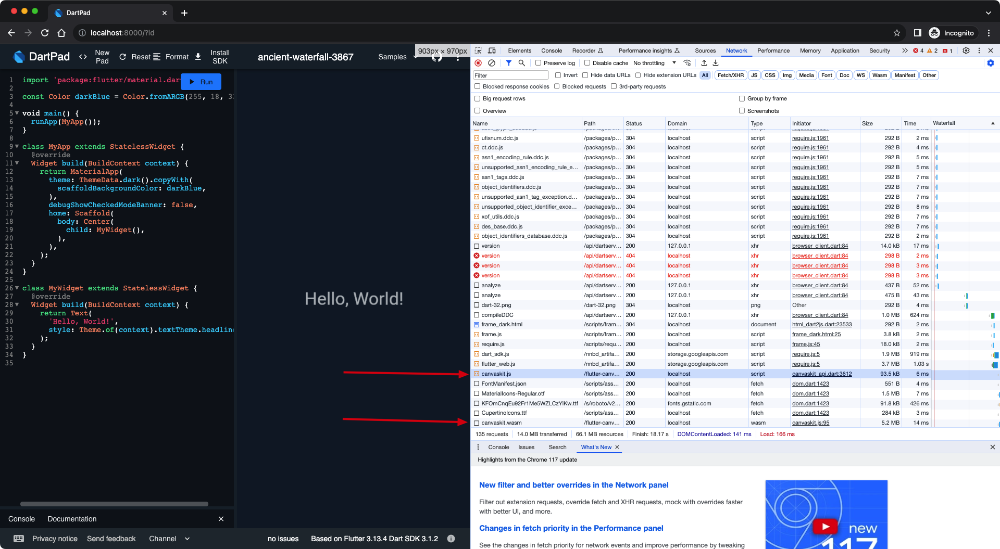

###  `dart_sdk.js` 和 `flutter_web.js` 放本地

```
dart-pad/pkgs/dart_services
├── static_resource
   └── nnbd_artifacts
       └── 3.1.2
           ├── dart_sdk.js
           └── flutter_web.js
```

既然有静态资源，那就要有静态资源服务器。这两个资源原来是在 `storage.googleapis.com`  中，我们可以把它放到专有的静态资源服务器下，为了方便，我们把这俩资源文件放到 dart_services 中管理，并在 dart_services 顺便启动静态服务。
在 `dart_service/pubspec.yaml` 中添加依赖  `shelf_static: ^1.1.2`
在 `dart-pad/pkgs/dart_services/lib/server.dart` 中添加对静态资源的支持

```dart
EndpointsServer._(String? redisServerUri, Sdk sdk) {
    ...

	/// handle static resource
    final staticResoucePath =
        path.join(Directory.current.path, 'static_resource');
    final staticHandler =
        createStaticHandler(staticResoucePath, listDirectories: true);

    pipeline = const Pipeline()
        .addMiddleware(logRequestsToLogger(_logger))
        .addMiddleware(createCustomCorsHeadersMiddleware());

	/// add static handler
    final cascade = Cascade();
    handler = pipeline.addHandler(
        cascade.add(staticHandler).add(commonServerApi.router.call).handler);
  }
```

### Flutter 字体放本地
重启后可以看到Flutter程序能正常渲染出来。但是还剩一个需要从`font.gstatic.com`。我们去 dart_sdk.js 中把它改成从我们本地服务器获取。


打开本地的 `dart_sdk.js` 文件，找到

```js
/*_engine._robotoUrl*/get _robotoUrl() {
      return "https://fonts.gstatic.com/s/roboto/v20/KFOmCnqEu92Fr1Me5WZLCzYlKw.ttf";
    },
```

改成

```js
/*_engine._robotoUrl*/get _robotoUrl() {
      return "../font/KFOmCnqEu92Fr1Me5WZLCzYlKw.ttf";
    },
```
把 `KFOmCnqEu92Fr1Me5WZLCzYlKw.ttf` f放到 `dart-pad/pkgs/dart_pad/web/font` 中。


重启 `dart_pad` 和 `dart_service`，**断网**，然后打开 `http://localhost:8000/` 这时 Flutter 也可以正常预览了

## Github sample 放本地
如果需要把 Gthub sample 也放到本地，或者其他的代码放到本地，可以参考这一小节

```dart
/// 打开 pkgs/dart_pad/lib/sharing/gists.dart
/// 修改 _gistApiUrl 如下
static const String _gistApiUrl = './gists';
```

把 代码放到如下位置

```
dart-pad/pkgs/dart_pad/web/
├── gists
│   ├── 493c8b3ef8931cbac3fbbe5c04b9c4cf
│   ├── 4a546fc44db8aca351bfe791e251acc2
│   ├── 4a68e553746602d851ab3da6aeafc3dd
│   ├── 5c0e154dd50af4a9ac856908061291bc
│   ├── 85e77d36533b16647bf9b6eb8c03296d
│   ├── a133148221a8cbacbcef8bc77a6c82ec
│   ├── a1d5666d6b54a45eb170b897895cf757
│   ├── c0f7c578204d61e08ec0fbc4d63456cd
│   ├── d3bd83918d21b6d5f778bdc69c3d36d6
│   ├── d57c6c898dabb8c6fb41018588b8cf73
│   ├── e75b493dae1287757c5e1d77a0dc73f1
│   ├── ecabed4a17a3aad8bee7c6327e472fc8
│   ├── ef06ab3ce0b822e6cc5db0575248e6e2
│   └── fdd369962f4ff6700a83c8a540fd6c4c
```


至此，Dartpad 可以完全在本地运行了

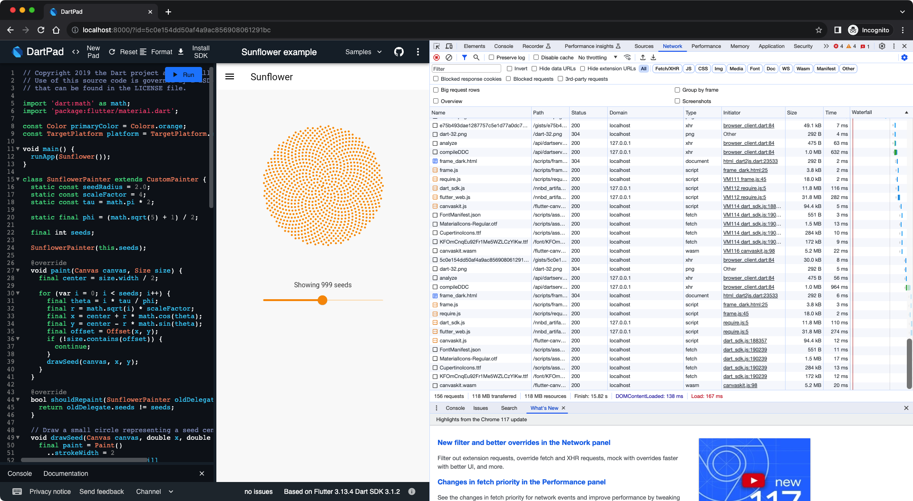

## 使用dartpad-local

全部修改较多，我把修改后的版本放到了 https://github.com/frankfancode/dartpad-local
除了 `flutter-canvaskit` 中资源的哈希名字需要根据本地情况进行修改外。执行以下命令即可使用。

```bash
# start dart_pad
cd dart-pad/pkgs/dart_pad
dart ./tool/grind.dart serve-local-backend

# start dart_services
cd dart-pad/pkgs/dart_services
# first time run it
FLUTTER_CHANNEL="stable" DART_SERVVICE_HOST_PATH="http://127.0.0.1:8082" dart tool/grind.dart serve

# after first run it
FLUTTER_CHANNEL="stable" DART_SERVVICE_HOST_PATH="http://127.0.0.1:8082" dart tool/grind.dart run

```

## 最后
如有问题，请联系我

## 参考资料
[How to create a custom DartPad?] (https://medium.com/flutter-clan/how-to-create-a-custom-dartpad-b903939df94c)